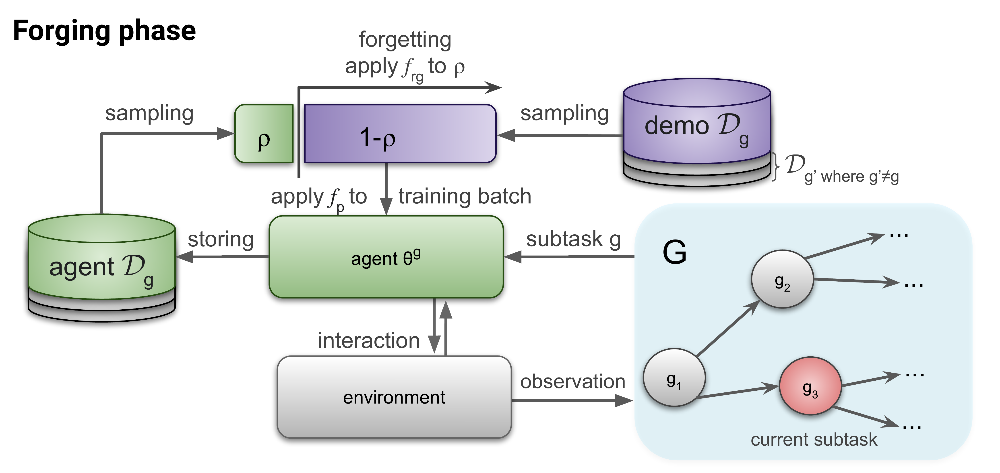

# ForgER: Forgetful Expirience Replay for Reinforcement Learning from Demonstrations

This repository is the TF2.0 implementation of Forgetful Replay Buffer for Reinforcement Learning from Demonstrations by [Alexey Skrynnik](https://github.com/Tviskaron), [Aleksey Staroverov](https://github.com/alstar8), [Ermek Aitygulov](https://github.com/ermekaitygulov), [Kirill Aksenov](https://github.com/axellkir), [Vasilii Davydov](https://github.com/dexfrost89), [Aleksandr I. Panov](https://github.com/grafft). 


[[Paper]](https://www.sciencedirect.com/science/article/pii/S0950705121001076) [[arxiv]](https://arxiv.org/abs/2006.09939) [[Webpage]](https://sites.google.com/view/forgetful-experience-replay)




## Installation

To install requirements:

```setup
pip install -r docker/requirements.txt
```

## Evaluating ForgER++

To download pretrained weights:
```shell
python utils/load_weights.py
```

To run evaluation in *ObtainDiamond* task:
```shell
python main.py --config configs/eval-diamond.yaml
```

To run evaluation in *Treechop* task: 
```shell
python main.py --config configs/eval-treechop.yaml
```


## Training

Downloading MineRL dataset:

```train
python utils/load_demonstrations.py 
```

Training ForgER on *Treechop* task: 

```train
python main.py --config configs/train-treechop.yaml
```

Training ForgER on *ObtainDiamondDense* task: 

```train
python main.py --config configs/train-diamond.yaml
```
**Caution:** We don't test reproducibility  after moving to TF2 version and updating code for MineRL version 0.4.   


## Results on MineRLObtainDiamond-v0 (1000 seeds)

| Item | MineRL2019 | ForgER | ForgER++|
| --- | --- | --- | --- |
| log | 859 | **882** | 867 |
| planks | 805 | **806** | 792 |
| stick | 718 | 747 | **790** |
| crafting table | 716 | 744 | **790** |
| wooden pickaxe | 713 | 744 | **789** |
| cobblestone | 687 | 730 | **779** |
| stone pickaxe | 642 | 698 | **751** |
| furnace | 19 | 48 | **98** |
| iron ore | 96 | 109 | **231** |
| iron ingot | 19 | 48 | **98** |
| iron pickaxe | 12 | 43 | **83** |
| diamond | 0 | 0 | **1** |
| mean reward | 57.701 | 74.09 | **104.315** |

## Citation
If you use this repo in your research, please consider citing the paper as follows:
```
@article{skrynnik2021forgetful,
  title={Forgetful experience replay in hierarchical reinforcement learning from expert demonstrations},
  author={Skrynnik, Alexey and Staroverov, Aleksey and Aitygulov, Ermek and Aksenov, Kirill and Davydov, Vasilii and Panov, Aleksandr I},
  journal={Knowledge-Based Systems},
  volume={218},
  pages={106844},
  year={2021},
  publisher={Elsevier}
}
```
